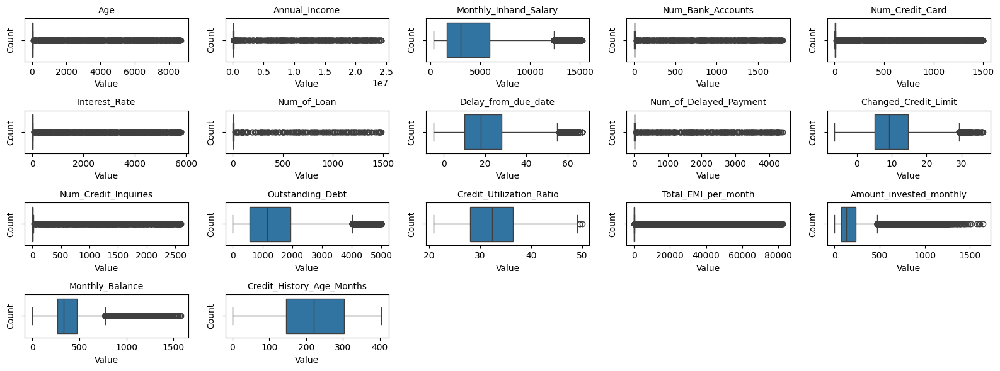
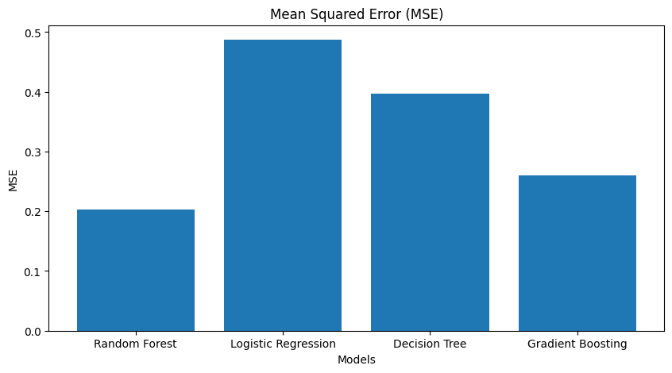
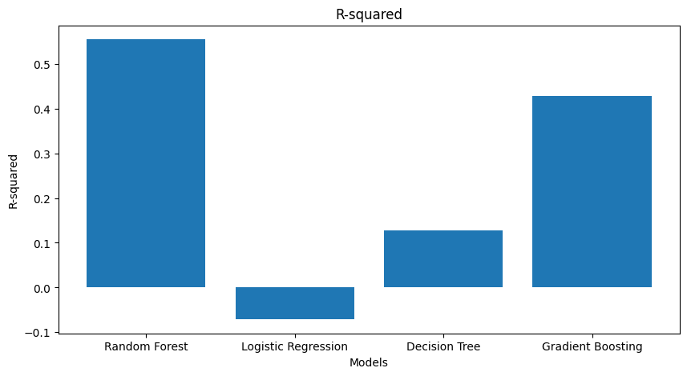

# Credit scoring (Machine Learning Terapan) - Dicoding

Muhammad Radiga Gubarda

## Credit Scoring

### Overview

## Business Understanding

# Problem Statement

Saat ini industri Perbankan dan Fintech mengalami kemajuan yang pesat seiring dengan kemajuan teknologi. Banyak product yang ditawarkan oleh perbankan dan Fintech seperti Tabungan, Deposito, serta Pinjaman. Pemberian pinjaman kepada individu atau perusahaan memiliki risiko gagal bayar. Hal tersebut membuat bank dan fintech dapat menghadapi kerugian yang tinggi akibat dari gagal bayar. Metode manual dalam menilai Credit Scoring memiliki kelemahan seperti rentan terhadap kesalahan , subjektivitas, dan butuh waktu. Hal tersebut membuat proses credit scoring tidaklah efisien.

# Goals

Proyek ini bertujuan untuk membuat model prediksi yang dapat membantu Perbankan memberikan pinjaman ke konsumen dengan lebih efektif dan efisien. Dengan model ini, perbankan bisa memberikan keputusan yang lebih objektif dan efisien, serta mengurangi risiko nasabah gagal bayar. Model ini akan mempertimbangkan banyak faktor, seperti usia, pendapatan tahunan, gaji bulanan, jumlah rekening bank, kartu kredit, suku bunga, jumlah pinjaman, keterlambatan pembayaran, perubahan limit kredit, utang yang belum terbayar, rasio pemakaian kredit, cicilan per bulan, investasi bulanan, saldo bulanan, usia riwayat kredit, jenis kredit, perilaku pembayaran, skor kredit, hingga pekerjaan konsumen.

# Solution

Menggunakan empat model untuk membandingkan dan memberikan solusi yang terbaik dalam membuat Credit Scoring Predictive yang efektif dan efisien. Adapun model yang digunakan adalah Random Forest, Logistic Regresion, Decision Tree, dan Gradien Boosting. Metrik evaluasi menggunakan Mean Squared Error (MSE) untuk mengukur seberapa besar model salah dalam melakukan predictive sementara R-squared digunakan untuk mengetahui seberapa baik model dalam mengevaluasi pola data.

### Dataset

Melakukan Data Acquisition Credit Scoring dari Kaggle https://www.kaggle.com/datasets/parisrohan/credit-score-classification/data . Dataset ini memiliki 100.000 data yang terdiri dari 28 Columns. Dataset ini menjelaskan mengenai informasi customers termasuk data-data demografi, payment behaviour, credit score. Tujuan dari project ini adalah membuat sistem yang efektif dalam melakukan prediksi peminjam berdasarkan tiga kategori Good, Standard, dan Poor.

Dataset

ID: Unique identifier.

Customer_ID: ID untuk setiap konsumen.

Month: Bulan.

Name: Nama konsumen.

Age: Umur Konsumen.

SSN: Social Security Number of the customer.

Occupation: Pekerjaan konsumen.

Annual_Income: Pendapatan tahunan.

Monthly_Inhand_Salary: Pendapatan bersih setiap bulan.

Num_Bank_Accounts: Jumlah akun bank milik konsumen.

Num_Credit_Card: Jumlah kartu kredit yang dimiliki konsumen.

Interest_Rate: Sukuk bunga.

Num_of_Loan: Jumlah pinjaman konsumen.

Type_of_Loan: Tipe pinjaman konsumen.

Delay_from_due_date: Keterlambatan bayar oleh konsumen.

Num_of_Delayed_Payment: Jumlah dana yang telat dibayar oleh konsumen.

Changed_Credit_Limit: limit karu kredit yang idubah.

Num_Credit_Inquiries: Jumlah permintaan kredit yang dilakukan oleh nasabah.

Credit_Mix: Campuran dari berbagai jenis rekening kredit yang dimiliki oleh nasabah.

Outstanding_Debt: Jumlah Outstanding debt.

Credit_Utilization_Ratio: Rasio kartu kredit yang dapat digunakan.

Credit_History_Age: Umur kartu kredit.

Payment_of_Min_Amount: Minimum pembayaran yang dilakukan.

Total_EMI_per_month: Total Equated Monthly Installment (EMI) yang dibayar oleh konsumen.

Amount_invested_monthly: Jumlah investasi bulanan.

Payment_Behaviour: Cara Bayar Konsumen.

Monthly_Balance: Jumlah saldo bulanan.

Credit_Score: Credit score konsumen.

### Model

Model yang digunakan adalah Random Forest, Logistic Regresion, Decision Tree, dan Gradien Boosting. Metrik evaluasi menggunakan Mean Squared Error (MSE) untuk mengukur seberapa besar model salah dalam melakukan predictive sementara R-squared digunakan untuk mengetahui seberapa baik model dalam mengevaluasi pola data.

### Performance

#### MSE

#### R-Squared

#### Kesimpulan

Model Random Forest dengan Mean Squared Error (MSE) sebesar 0.2027 dan R-squared sebesar 0.5545, menunjukkan bahwa model ini memiliki tingkat kesalahan yang relatif rendah dibandingkan dengan model lainnya. Sebaliknya, Logistic Regression memiliki performa paling rendah dengan MSE sebesar 0.4873 dan R-squared negatif sebesar -0.0711.

Decision Tree memiliki MSE sebesar 0.3966 dan R-squared sebesar 0.1281 menunjukkan performa yang lebih baik daripada Logistic Regression, tapi masih jauh dari Random Forest. Sementara Gradient Boosting memiliki hasil yang baik dengan MSE sebesar 0.2602 dan R-squared sebesar 0.4280, meski masih di bawah Random Forest.
